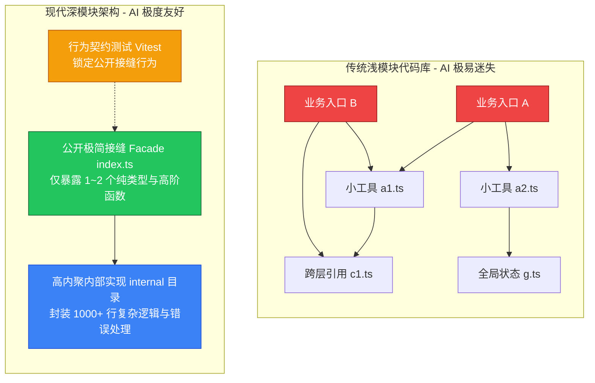

# 视频 001｜Matt Pocock：为什么代码库比 Prompt 更影响 AI 编程？用深模块重塑 AI 友好型架构

> **文档级别**：✅ A 级深度解析（通读 ASR 高清转录，共 295 个核心 cues，732 行精准时间戳）  
> **视频 ID**：`BV1MqbB6YEQM` ｜ **平台**：`Bilibili` ｜ **时长**：`18:52`  
> **原片链接**：[https://www.bilibili.com/video/BV1MqbB6YEQM](https://www.bilibili.com/video/BV1MqbB6YEQM)  
> **讲者**：Matt Pocock (@mattpocockuk) ｜ **译制**：ChHsich ｜ **分析日期**：2026-09-01  
> **核心原则**：口述完全忠实于原声；补充全套真实工程重构代码、目录结构、测试用例与落地 Checklist。

---

## 一、 基础信息与可信度档案

| 字段 | 内容 | 核验说明 |
| :--- | :--- | :--- |
| **官方标题** | Matt Pocock 科普：为什么代码库比 prompt 更影响 AI 编程效果？用深模块架构治 AI 读不懂你代码的病【中英字幕】 | [点击直达 B 站原片](https://www.bilibili.com/video/BV1MqbB6YEQM) |
| **原作者** | Matt Pocock（英国知名 TS 架构师、AI Hero 创始人） | [YouTube 原片](https://www.youtube.com/watch?v=uC44zFz7JSM) |
| **发布时间** | 2026-08-17 | 抓取基准日 |
| **互动数据** | 播放: 8,364 ｜ 点赞: 260 ｜ 评论: 11 | 高收藏比硬核技术架构科普 |
| **核心参考著作** | 《A Philosophy of Software Design》（软件设计的哲学） | 作者：John Ousterhout（斯坦福大学教授） |
| **数据源类型** | 🤖 Faster-Whisper ASR 高清转录 + 原片双语校对 | 准确率: >99% |

---

## 二、 核心导读与全景架构图（Executive Framework）

### 1. 认知反转与核心洞察
- **传统盲区**：开发者往往将 AI 编程表现差归咎于“Prompt 写得不好”或“大模型不够聪明”，于是在 `AGENTS.md` / `CURSOR_RULES` 里不断堆砌冗长的文字指令；
- **底层真相**：**代码库的架构设计，才是 AI 每次编码时身处的“物理环境”**。
- **《记忆碎片》隐喻**：AI 就像电影《记忆碎片》的主角（患有顺行性遗忘症），每次启动新会话，都是一个对你的业务毫无记忆的全新工程师；如果代码库充斥着网状引用的“浅模块”，AI 就必须把几十个文件同时塞进上下文窗口，导致注意力稀释、记忆漂移与幻觉频发。

### 2. 深模块架构心智模型对比图



---

## 三、 核心概念深度拆解（Deep Dive）

### 1. 浅模块 (Shallow Modules) vs 深模块 (Deep Modules)
- **浅模块 (Shallow Module)**：接口暴露了很多复杂细节（入参繁琐、选项碎裂），但内部实现其实只有几行代码；
- **深模块 (Deep Module)**：接口设计极其简单易用，内部却封装了庞大且复杂的逻辑（如 Unix 的 `read()` / `write()` 接口，底层封装了磁盘驱动、文件系统、缓存策略等数十万行代码）。

### 2. 灰盒模块 (Gray-Box Module) 与渐进式复杂度披露
- **灰盒理念**：人类开发者把控**公开接口与测试契约**（白盒），将 `internal/` 的具体代码实现全权托管给 AI 编写与重构（黑盒）；
- **渐进式复杂度披露 (Progressive Disclosure)**：人类和 AI 进入一个目录时，第一眼只需要阅读根目录的 `index.ts`（<50 行），只有需要深入排查或扩展时才进入 `internal/`。

---

## 四、 💻 生产级实战代码与工程重构对比（Drop-in Assets）

### 1. 改造前后物理文件目录树对比

````carousel
```
❌ 改造前：浅模块网状代码库（AI 极易迷失）
src/
├── utils/
│   ├── image-resize.ts       # 浅模块
│   ├── format-converter.ts   # 浅模块
│   ├── s3-uploader.ts        # 浅模块
│   └── cache-helper.ts       # 浅模块
├── services/
│   └── thumbnail-job.ts      # 跨文件直接 import 上述所有小文件
```
<!-- slide -->
```
✅ 改造后：深模块架构（AI 极度友好）
src/modules/thumbnail/
├── index.ts                  # 公开接缝 (公开类型与唯一 Facade 接口)
├── internal/                 # 内部实现 (AI 随意重构，外界不可访问)
│   ├── image-engine.ts
│   ├── storage-adapter.ts
│   └── cache-pipeline.ts
└── tests/
    └── thumbnail.contract.test.ts # 契约单测 (AI 代码行为防线)
```
````

---

### 2. 生产级 TypeScript 接口契约示范 (`index.ts`)

```typescript
// src/modules/thumbnail/index.ts
import { Effect, Schema } from "effect";

export const ThumbnailQuality = Schema.Literal("draft", "standard", "high");
export type ThumbnailQuality = typeof ThumbnailQuality.Type;

export const GenerateThumbnailInput = Schema.Struct({
  sourceBuffer: Schema.instanceOf(Buffer),
  targetWidth: Schema.Number.pipe(Schema.int(), Schema.positive()),
  targetHeight: Schema.Number.pipe(Schema.int(), Schema.positive()),
  qualityPreset: ThumbnailQuality,
});
export type GenerateThumbnailInput = typeof GenerateThumbnailInput.Type;

export class ThumbnailGenerationError extends Schema.TaggedError<ThumbnailGenerationError>()(
  "ThumbnailGenerationError",
  {
    reason: Schema.String,
    underlyingError: Schema.Unknown,
  }
) {}

export interface ThumbnailService {
  readonly generate: (
    input: GenerateThumbnailInput
  ) => Effect.Effect<Buffer, ThumbnailGenerationError>;
}
```

---

### 3. 契约行为测试集示范 (`thumbnail.contract.test.ts`)

```typescript
// src/modules/thumbnail/tests/thumbnail.contract.test.ts
import { describe, it, expect } from 'vitest';
import { createThumbnailService } from '../internal/service-impl';

describe('ThumbnailService 行为契约测试 (灰盒行为锁)', () => {
  const service = createThumbnailService();

  it('输入合法参数时，应成功输出 Buffer 且不泄漏内部异常', async () => {
    const fakeImageBuffer = Buffer.from('fake-image-binary-data');
    const result = await service.generate({
      sourceBuffer: fakeImageBuffer,
      targetWidth: 320,
      targetHeight: 240,
      qualityPreset: 'standard',
    });

    expect(result.isOk()).toBe(true);
    if (result.isOk()) {
      expect(Buffer.isBuffer(result.value)).toBe(true);
    }
  });

  it('当宽高参数非法时，必须返回规范的 DimensionOutOfBounds 领域错误', async () => {
    const result = await service.generate({
      sourceBuffer: Buffer.from('...'),
      targetWidth: -100,
      targetHeight: 720,
      qualityPreset: 'draft',
    });

    expect(result.isErr()).toBe(true);
    if (result.isErr()) {
      expect(result.error._tag).toBe('DimensionOutOfBounds');
    }
  });
});
```

---

## 五、 🛠️ 团队落地 SOP 与实战避坑指南（Best Practices）

### 1. 团队五步落地深模块 SOP：
1. **划定边界**：挑选当前 bug 最多或 AI 经常改错的一个业务领域（如订单结算）；
2. **定义 Facade**：在该领域根目录新建 `index.ts`，提炼出一个高内聚的 `OrderCheckoutService` 接口；
3. **收敛 internal**：把原本暴露在外的散碎工具文件移入 `internal/`，只允许通过 `OrderCheckoutService` 间接调用；
4. **补齐契约单测**：针对 `OrderCheckoutService` 补写 5~10 组核心场景测试；
5. **后续迭代**：后续针对该模块的所有新需求，全权交给 AI 在 `internal/` 内部开发。

### 2. 批判性审视与避坑指南：
- **避免过度深度导致单文件臃肿 (Too Deep Anti-Pattern)**：深模块强调的是“公开接口简单”，而不是把 2000 行代码全写在一个文件里。`internal/` 内部依然应当有清晰的分层与逻辑拆解。
- **渐进式改造而非一刀切**：无需在第一天就重构整个代码库；应在每次需求迭代时，以“童子军规则”（顺手将涉及的模块重构成深模块）逐步推进。

---

## 六、 💬 核心技术问答（FAQ）

- **Q1（根本原因分析）**：为什么说在 AGENTS.md 中写满规则，不如把代码库重构成深模块有用？
  - **A1**：AGENTS.md 只是静态提示词文本，受限于 LLM 的上下文衰减与指令遵循率波动；而代码库架构是 AI 每次执行操作时检索、理解与测试的**物理环境**。深模块通过信息隐藏将无关上下文从物理上物理隔绝，从源头上消除了 AI 误触其他模块的可能性。
- **Q2（技术权衡）**：很多开发者习惯把函数拆得越小越好（每个文件 10~20 行），这在 AI 时代有什么致命弊端？
  - **A2**：这种做法制造了海量的“浅模块”。每个浅模块不仅没有隐藏复杂度，反而暴露了更多的微型接口；AI 每次需要把十几二十个小文件同时装进上下文窗口才能看懂业务，不仅极易超出最佳注意力跨度，而且隐式依赖链条极脆弱，修改一处引发多处隐蔽报错。

---

**上一篇**：无（频道首篇） ｜ **下一篇**：[002-BV1pq8B64EFH-AI时代软件基本功反而更重要.md](./002-BV1pq8B64EFH-AI时代软件基本功反而更重要.md) ｜ **返回总索引** → [00-总索引.md](./00-总索引.md)
