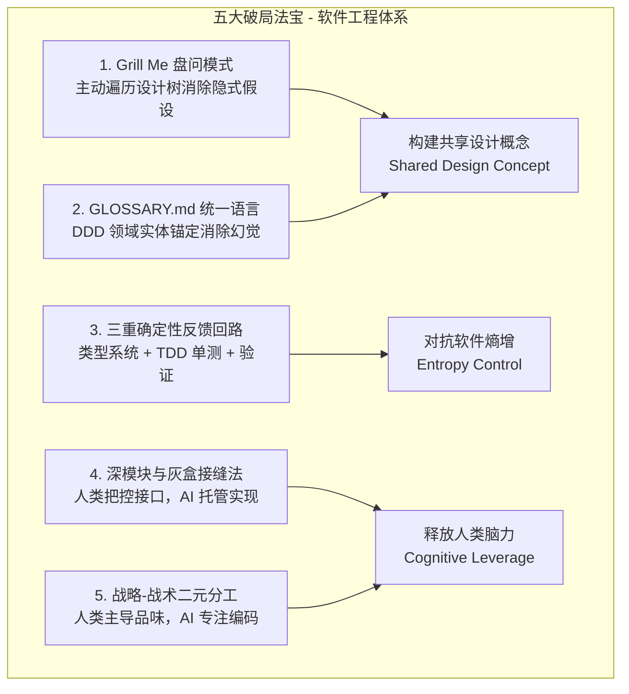

# 视频 002｜Matt Pocock 欧洲演讲：AI 时代，40 年前的软件基本功反而成了决定胜负的核心生产力

> **文档级别**：✅ A 级深度解析（通读 ASR 高清转录，共 2207 秒完整演讲，干货拉满）  
> **视频 ID**：`BV1pq8B64EFH` ｜ **平台**：`Bilibili` ｜ **时长**：`36:47`  
> **原片链接**：[https://www.bilibili.com/video/BV1pq8B64EFH](https://www.bilibili.com/video/BV1pq8B64EFH)  
> **讲者**：Matt Pocock (@mattpocockuk) ｜ **译制**：ChHsich ｜ **分析日期**：2026-09-01  
> **核心原则**：口述完全忠实于原声；提供全套可直接执行的 Skill 模版、术语表规范、代码重构对比与工程落地 SOP。

---

## 一、 基础信息与可信度档案

| 字段 | 内容 | 核验说明 |
| :--- | :--- | :--- |
| **官方标题** | Matt Pocock 演讲：AI 时代，软件基本功反而更重要 | AI Engineer Europe【中英字幕】 | [点击直达 B 站原片](https://www.bilibili.com/video/BV1pq8B64EFH) |
| **原作者** | Matt Pocock（Total TypeScript 创始人、知名 AI 架构布道者） | [YouTube 官方录播](https://www.youtube.com/watch?v=v4F1gFy-hqg) |
| **发布时间** | 2026-08-21 | 抓取基准日 |
| **互动数据** | 播放量: 6,345 ｜ 点赞: 228 ｜ 评论: 23 | 顶级 AI 工程师峰会现场演讲 |
| **参考著作** | 《人月神话》《设计的设计》《软件设计的哲学》《程序员修炼之道》 | 计算机工程经典理论 |
| **数据源类型** | 🤖 Faster-Whisper ASR 高清转录 + 原片双语校对 | 准确率: >99% |

---

## 二、 核心导读与全景架构图（Executive Framework）

### 1. 核心论点与颠覆性认知
- **“Spec-to-Code”是必输的伪命题**：许多人幻想“只要给 AI 一份规格说明书，让它直接在后台编译跑通即可”，但事实证明代码不仅是机器执行的指令，更是**人类和 AI 理解复杂系统的数据结构**；
- **AI 时代坏代码的代价达到史上最高**：坏代码会导致 AI 理解成本呈指数级膨胀，最终陷入“改 A 坏 B，越修越烂”的死循环；
- **软件基本功是 AI 的最强杠杆**：40 年前的经典软件工程原则（信息隐藏、统一语言、强反馈回路、战略/战术分工）在今天反而变成了最核心的生产力。

### 2. 五大破局工程法宝全景图



---

## 三、 核心概念逐层深度拆解（Deep Dive）

### 1. 法宝一：Grill Me 模式（从“盲目生成”到“双向盘问”）
- **痛点**：人类在提出需求时，脑中 80% 的架构细节和边界条件并未写进 Prompt 里，AI 只能靠猜；
- **解法**：在 AI 动手写代码前，强制让 AI 扮演严苛的架构师，向人类连环追问 10~20 个边界问题，直到双方在“设计树”的每个分叉上达成共识。

### 2. 法宝二：`GLOSSARY.md` 统一语言（DDD Ubiquitous Language）
- 在项目根目录维护极简的业务术语表，彻底消灭 `user` / `account` / `member` 混用的乱象，直接约束大模型的概率生成分布。

### 3. 法宝三：三重确定性反馈回路（对抗软件熵增）
- **第一层**：TypeScript / Rust 严格静态类型（毫秒级阻断语法与类型低级错误）；
- **第二层**：针对深模块公开接口的 TDD 契约单测（秒级验证行为正确性）；
- **第三层**：端到端与灰盒自愈机制（促使 AI 在反馈闭环内自主排错）。

---

## 四、 💻 生产级实战代码与工程模版（Drop-in Assets）

### 1. 业务术语表标准范式 (`GLOSSARY.md`)
```markdown
# 领域术语表 (Domain Glossary)

## 实体定义 (Entities)
- **User (用户)**：系统终端自然人，具备唯一 `userId (UUID)`；
- **Account (账套)**：用户的计费结算主体，一个 User 可拥有多个 Account；
- **Subscription (订阅)**：绑定在 Account 下的付费计划状态。

## 状态机转换约定
- `SubscriptionState`: `Pending` -> `Active` -> `GracePeriod` -> `Canceled`
```

---

### 2. 深模块鉴权服务接缝设计示范 (`auth/index.ts`)
```typescript
import { Result } from 'true-myth';

export interface AuthenticateInput {
  readonly authHeader?: string;
  readonly clientIp: string;
}

export interface SessionContext {
  readonly userId: string;
  readonly accountId: string;
  readonly roles: readonly ('admin' | 'member')[];
}

export type AuthFailureReason =
  | { readonly _tag: 'MissingToken' }
  | { readonly _tag: 'TokenExpired'; readonly expiredAt: Date }
  | { readonly _tag: 'SignatureMismatch' }
  | { readonly _tag: 'AccountSuspended'; readonly reason: string };

export interface AuthService {
  /**
   * 鉴权统一入口：内部隐藏多重缓存、数据库校验与风控拦截
   */
  readonly verify: (
    input: AuthenticateInput
  ) => Promise<Result<SessionContext, AuthFailureReason>>;
}
```

---

## 五、 🛠️ 实战避坑指南与落地 SOP（Best Practices）

1. **Grill Me 适度原则**：避免对极其简单的微小修改过度盘问；只有在涉及架构变动、数据流变更时才开启深度盘问；
2. **术语表的动态同步成本**：业务演进时需同步维护 `GLOSSARY.md`，可结合 CI 脚本定期扫描代码库实体。

---

## 六、 💬 核心技术问答（FAQ）

- **Q1（核心命题）**：为什么说“Spec-to-Code（给一段说明直接跑编译器不管代码）”是不可行的？
  - **A1**：因为代码不仅仅是编译器执行的字节码，更是系统状态与依赖关系的载体。每次修改如果只看 Spec 而不顾整体系统架构，局部修改引发的隐式冲突会迅速累积，软件熵增会导致后续生成的代码越来越差，最终完全崩溃。
- **Q2（实操技巧）**：如何在日常 AI 编程中运用“灰盒法”将开发效率提升 3 倍？
  - **A2**：1. 精心设计顶层深模块接口；2. 为该接口编写完备的行为测试用例；3. 将实现工作完全交给 AI（不必逐行审查内部代码）；4. 只要测试全部绿灯且类型检查通过，即可直接合并上线。
- **Q3（经典回归）**：为什么 20~40 年前的《软件设计的哲学》《程序员修炼之道》《设计的设计》在 AI 时代反而更有价值？
  - **A3**：因为 AI 拥有无限的生成代码能力，但极度缺乏对“系统复杂度”的全局感知力。这三本书阐述的本质——信息隐藏、模块深度、共享设计概念、控制熵增——恰恰是约束和引导 AI 强大生成能力所必需的骨架。

---

**上一篇**：[001-BV1MqbB6YEQM-为什么代码库比prompt更影响AI编程效果.md](./001-BV1MqbB6YEQM-为什么代码库比prompt更影响AI编程效果.md) ｜ **下一篇**：[003-BV1zUh56RE8k-十分钟讲完25个Skills与AI编程工程范式.md](./003-BV1zUh56RE8k-十分钟讲完25个Skills与AI编程工程范式.md) ｜ **返回总索引** → [00-总索引.md](./00-总索引.md)
