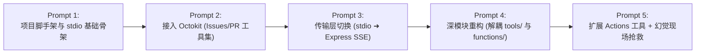

# 视频 004｜Matt Pocock 实战教程：5 条 Prompt 从零搭一个 MCP Server 与结构化 AI 编程范式

> **文档级别**：✅ A 级深度解析（通读 ASR 高清转录，时长 12:41，代码与实战 SOP 逐一还原）  
> **视频 ID**：`BV1mubY6jE4u` ｜ **平台**：`Bilibili` ｜ **时长**：`12:41`  
> **原片链接**：[https://www.bilibili.com/video/BV1mubY6jE4u](https://www.bilibili.com/video/BV1mubY6jE4u)  
> **讲者**：Matt Pocock (@mattpocockuk) ｜ **译制**：ChHsich ｜ **分析日期**：2026-09-01  
> **官方 Gist 提示词集**：[gist.github.com/mattpocock/0aae0ed9b604750f07dee0ea75d8b03d](https://gist.github.com/mattpocock/0aae0ed9b604750f07dee0ea75d8b03d)

---

## 一、 核心认知：严肃 AI 工程 (Sensible AI Dev) vs 氛围编程 (Vibe Coding)

Matt Pocock 在开场一针见血地指出了当前 AI 编程的两种截然不同的路线：

```
┌───────────────────────────────────────┐       ┌───────────────────────────────────────┐
│        氛围编程 (Vibe Coding)         │       │      严肃 AI 工程 (Sensible AI Dev)    │
├───────────────────────────────────────┤       ├───────────────────────────────────────┤
│ ❌ 盲目丢一句话让 AI 自由发挥         │  VS   │ ✅ 规划、文档、结构化约束先行         │
│ ❌ 会话越拉越长，代码逐步失控腐化     │       │ ✅ 5 个独立单点迭代，步步为营         │
│ ❌ 遇到 Bug 盲目让 AI 反复试错       │       │ ✅ 显式上下文锚定，精准消除幻觉       │
│ ❌ 缺乏代码规范与接口接缝设计         │       │ ✅ 协议层与业务逻辑严格分层           │
└───────────────────────────────────────┘       └───────────────────────────────────────┘
```

---

## 二、 Matt Pocock 黄金三段式 Prompt 模板架构

不要把所有事情混成一段话，而要分为三大标准板块：

```markdown
# 1. Problem (问题与目标)
- 陈述本次 Prompt 需要解决的具体目标；
- 明确输入状态（如从空目录开始、已有某某文件）与预期输出。

# 2. Supporting Information (支撑信息与技术约束)
- 填补大模型预训练数据中的知识盲区（如特定 TSX 命令行参数、包管理器规范）；
- 规定文件系统树架构与命名约定；
- 声明必须遵守的安全与设计规则（如必须为每个 Tool 写 Description）。

# 3. Steps To Complete (确定性分步执行指令)
- 按时间线给出清晰的步骤编号 (1, 2, 3...)；
- 包含“先加载现有代码”、“安装依赖”、“编写代码”、“自检验证”的具体指令。
```

---

## 三、 5 个 Prompt 完整演进过程与关键技术细节



---

### 1. Prompt 1：初始化 TypeScript MCP 项目骨架

#### 🎯 核心意图
从空目录构建标准 TypeScript MCP Server，配置 pnpm、tsconfig、package.json 以及 Cursor 规则文件。

#### 💻 生产级工程规范配置
```json
// package.json 关键配置
{
  "name": "github-mcp-server",
  "version": "1.0.0",
  "type": "module",
  "bin": {
    "github-mcp": "./dist/main.js"
  },
  "scripts": {
    "build": "tsc",
    "dev": "tsx --env-file=.env src/main.ts"
  },
  "dependencies": {
    "@modelcontextprotocol/sdk": "^1.0.4",
    "dotenv": "^16.4.7",
    "zod": "^3.24.1"
  },
  "devDependencies": {
    "@types/node": "^22.0.0",
    "tsx": "^4.19.2",
    "typescript": "^5.7.3"
  }
}
```

---

### 2. Prompt 2：集成 GitHub Octokit 工具集

#### 🎯 核心意图
引入 Octokit，封装对 GitHub Issue 与 Pull Request 的读写工具。

#### ⚠️ 关键工程规则：**Tool 必须强制声明 Description**
在 MCP 协议中，客户端（如 Claude / Cursor / Antigravity）是通过 Tool 的 Description 来判断用户意图并触发调用的。
```typescript
// 推荐写法：必须带完整 description 与 zod schema
server.tool(
  "create_issue",
  "Create a new GitHub issue in the specified repository with title and body",
  {
    owner: z.string().describe("Repository owner (user or organization)"),
    repo: z.string().describe("Repository name"),
    title: z.string().describe("Issue title"),
    body: z.string().optional().describe("Issue markdown body content"),
  },
  async ({ owner, repo, title, body }) => {
    const res = await octokit.rest.issues.create({ owner, repo, title, body });
    return {
      content: [{ type: "text", text: `Issue created successfully: ${res.data.html_url}` }],
    };
  }
);
```

---

### 3. Prompt 3：从 stdio 切换为 Express SSE 远程传输

#### 🎯 核心意图
将原本只能通过本地子进程调用的 `stdio` 传输模式，改造为可以通过 HTTP 远程连接的 **Server-Sent Events (SSE)** 架构。

#### 💣 WSL / Express 避坑两大地雷：
1. **千万不要加 `app.use(express.json())`**：
   - Express 的 json 中间件会拦截或提前消费流式请求的 request body，导致 MCP 的 `/messages` 端点无法正确解析协议帧！
2. **Hono vs Express 在本地开发中的取舍**：
   - Matt 在实测中指出，某些轻量框架（如 Hono）在特定 Node/WSL 环境下对 SSE 连接的挂起处理可能出现兼容性问题，而标准的 Express + `@modelcontextprotocol/sdk/server/sse.js` 最为稳健。

```typescript
// src/main.ts (Express SSE 标准实现)
import express from "express";
import { McpServer } from "@modelcontextprotocol/sdk/server/mcp.js";
import { SSEServerTransport } from "@modelcontextprotocol/sdk/server/sse.js";

const app = express();
const server = new McpServer({
  name: "github-mcp",
  version: "1.0.0",
});

let transport: SSEServerTransport | null = null;

// 1. SSE 连接握手端点
app.get("/sse", async (req, res) => {
  transport = new SSEServerTransport("/messages", res);
  await server.connect(transport);
});

// 2. 客户端消息接收端点 (绝对不要挂载 express.json 中间件!)
app.post("/messages", async (req, res) => {
  if (transport) {
    await transport.handlePostMessage(req, res);
  } else {
    res.status(400).send("No active SSE session");
  }
});

app.listen(3001, () => {
  console.log("MCP SSE Server listening on http://localhost:3001/sse");
});
```

---

### 4. Prompt 4：领域解耦与深模块重构

#### 🎯 核心意图
当工具数量增长到十几个时，`main.ts` 会变成巨大泥球。将其重构为清晰的双层架构：

```
src/
├── main.ts                     # 极简入口：仅负责 Express 启动与服务监听
├── server.ts                   # MCP 实例初始化与工具挂载聚合
├── tools/                      # 【协议适配层】负责 Zod Schema 定义与 MCP server.tool 注册
│   ├── issues.ts
│   ├── pulls.ts
│   └── actions.ts
└── github/                     # 【纯净领域层】直接调用 Octokit，完全解耦 MCP 协议
    ├── client.ts
    ├── issue-functions.ts
    ├── pr-functions.ts
    └── action-functions.ts
```

---

### 5. Prompt 5：扩展 Actions 工具与【大模型幻觉抢救 SOP】

#### 🚨 真实翻车现场与排查
在让 AI 为项目添加 GitHub Actions 监控工具时，LLM 突然产生了严重幻觉：**它自己编造了一个不存在的辅助函数 `createTool.js` 并尝试在多个文件中引用**。

#### 💡 Matt Pocock 的黄金抢救 SOP（全片最值钱的一分钟）：
1. **不要在被污染的对话里跟 AI 解释/吵架**：在长对话中解释“你搞错了”只会让上下文充满错误代码的注意力痕迹；
2. **新开会话，使用“显式锚定指令”**：在 `Steps To Complete` 的第 1 步强制写入：
   ```markdown
   1. Read the existing implementation in `src/tools/issues.ts` and `src/tools/pulls.ts` into your context first;
   2. Ensure you strictly follow the exact pattern used in those files without inventing any helper functions like `createTool`;
   3. Implement `src/tools/actions.ts` and `src/github/action-functions.ts`.
   ```
3. **结果**：AI 立即回归正轨，一次性写出 100% 严谨、规范的代码！

---

## 四、 💻 可直接落地的工程资产与模板（Drop-in Assets）

### 1. 三段式 Prompt 极简脚手架模版
```markdown
# Problem
We need to add a new set of tools to our MCP server for managing GitHub Actions runs (list runs, get status, cancel run, retry workflow).

# Supporting Information
- We use Octokit rest API (`octokit.rest.actions.*`).
- Every tool must be registered via `server.tool` with a detailed human-readable description string.
- Follow our established directory structure: protocol adapters in `src/tools/actions.ts` and Octokit SDK calls in `src/github/action-functions.ts`.

# Steps To Complete
1. Read `src/tools/issues.ts` and `src/github/issue-functions.ts` to inspect our established error-handling and registration pattern;
2. Create `src/github/action-functions.ts` with typed helper functions for list, details, cancel, retry;
3. Create `src/tools/actions.ts` and register tools onto `McpServer`;
4. Export and register them in `src/server.ts`;
5. Run `pnpm build` to verify there are zero TypeScript compiler errors.
```

---

## 五、 💬 核心技术问答（FAQ）

- **Q1（架构原理）**：为什么开发 MCP Server 时必须把“MCP Tool 注册层”与“底层 SDK 调用层”拆分为两个目录？
  - **A1**：因为 MCP 协议只是一种“外部适配器（Adapter）”。将底层业务逻辑写成纯 TypeScript 函数，既可以脱离 MCP 协议进行独立单元测试，又可以在未来无缝迁移到 CLI、REST API 或其他 Agent 协议（如 OpenAI Function Calling），实现高内聚低耦合。
- **Q2（实战避坑）**：在 Express 中部署 MCP SSE 服务时，为什么不能使用 `app.use(express.json())`？
  - **A2**：因为 `express.json()` 中间件会尝试将所有 POST 请求的 Body 解析为 JSON 对象并消费掉底层的 Request Stream；而 MCP SDK 的 `SSEServerTransport.handlePostMessage` 需要自行接管并解析原始请求流，全局挂载 `express.json()` 会导致流被提前拦截而报错。

---

**上一篇**：[003-BV1zUh56RE8k-十分钟讲完25个Skills与AI编程工程范式.md](./003-BV1zUh56RE8k-十分钟讲完25个Skills与AI编程工程范式.md) ｜ **下一篇**：待增量分析 ｜ **返回总索引** → [00-总索引.md](./00-总索引.md)
