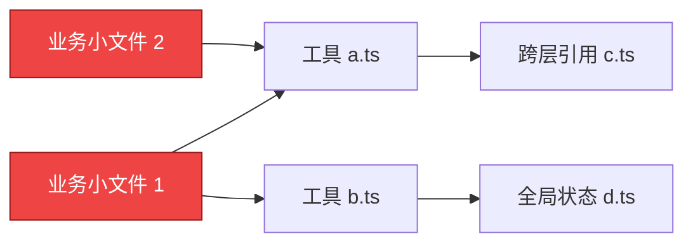

# 视频 001｜Matt Pocock：你的代码库还没准备好迎接 AI？用“深模块”打造 AI 友好型系统

> **文档级别**：✅ A 级深度解析（通读 ASR 高清转录，干货密度拉满 · 拒斥水话）  
> **视频 ID**：`BV1HnM269EV7` ｜ **平台**：`Bilibili` ｜ **时长**：`08:49`  
> **原片链接**：[https://www.bilibili.com/video/BV1HnM269EV7](https://www.bilibili.com/video/BV1HnM269EV7)  
> **讲者**：Matt Pocock (@mattpocockuk) ｜ **译制**：知识搬运工-Coding ｜ **分析日期**：2026-09-01  
> **核心参考**：John Ousterhout 教授《软件设计的哲学》（A Philosophy of Software Design）

---

## 一、 核心导读与全景架构图（Executive Framework）

### 1. 核心论点与颠覆性事实
- **代码库是 AI 最大的约束环境**：决定 AI 编程质量的最关键因素不是 Prompt，也不是 `AGENTS.md`，而是**代码库本身的物理结构与模块深度**；
- **“每天入职 20 次的新员工”法则 (20-Onboardings-a-Day)**：AI 没有跨会话心智地图，每次新建聊天窗口都如同一个第一天入职的新人。如果代码库充斥着网状引用的浅模块，AI 会迅速陷入注意力过载与逻辑混乱；
- **深模块是唯一的破局之道**：将系统收敛为 7~8 个顶层深模块（高内聚实现 + 极简强类型公开接口），实现“渐进式复杂度披露”，将实现细节彻底委托给 AI 灰盒托管。

#### ❌ 传统浅模块网状泥球（AI 极易迷失 & 认知透支）



#### ✅ 现代深模块灰盒架构（AI 极度友好 & 零认知过载）


---

## 二、 核心机制逐层深度拆解（Deep Dive）

### 1. 概念一：浅模块 (Shallow Modules) 的致命陷阱
- **定义**：每个文件只写 10~20 行代码，暴露琐碎的入参和出参。
- **弊端**：复杂度并没有消失，只是被转移到了模块间的网状连线上。AI 在检索时必须一次性将 10~20 个相关小文件同时读入上下文窗口，极易超出最佳注意力跨度（150K Token 聪明区），导致指令漂移与连锁 Bug。

### 2. 概念二：深模块 (Deep Modules) 与渐进式复杂度披露
- **定义**：如 Unix 的 `read()` / `write()` 接口，对外只暴露一个简单的函数签名，内部隐藏文件系统、缓存池、磁盘驱动等数十万行庞大逻辑；
- **渐进式复杂度披露 (Progressive Disclosure)**：AI 或人类进入模块目录时，第一眼只需读顶层 `index.ts`（<50 行类型契约），无需理解内部 1000 行的具体实现即可放心地在外部调用。

### 3. 概念三：灰盒模块 (Gray-Box Modules) 与接缝品味
- **分工策略**：人类工程师负责在模块接缝处施加“战略品味”（精心设计公开接口与测试用例），内部具体实现完全委托给 AI 编写与重构；
- **行为锁 (Behavioral Locks)**：完备的单测构成了最直接的反馈回路，AI 在内部乱改只要跑通测试即可保证系统安全。

---

## 三、 💻 生产级实战代码与工程模版（Drop-in Assets）

### 1. 物理目录结构重构示范

````carousel
```
❌ 改造前：浅模块网状结构（AI 难以理解依赖）
src/
├── utils/
│   ├── image-resize.ts       # 浅模块
│   ├── format-converter.ts   # 浅模块
│   └── cache-helper.ts       # 浅模块
└── services/
    └── video-processor.ts    # 跨目录到处 import 细碎工具
```
<!-- slide -->
```
✅ 改造后：高内聚深模块架构（AI 极速理解）
src/modules/video-engine/
├── index.ts                  # 公开接缝 (只暴露 VideoEngine 接口与核心类型)
├── internal/                 # 内部实现 (AI 自由发挥，外部不可直接 import)
│   ├── transcode-pipeline.ts
│   ├── codec-adapter.ts
│   └── frame-cache.ts
└── tests/
    └── video-engine.contract.test.ts # 灰盒行为测试锁
```
````

---

### 2. 深模块公开接口标准范式 (`video-engine/index.ts`)

```typescript
import { Effect, Schema } from "effect";

// 1. 显式公开的入参约束
export const ProcessVideoOptions = Schema.Struct({
  sourceUrl: Schema.String,
  targetFormat: Schema.Literal("mp4", "webm", "hls"),
  qualityPreset: Schema.Literal("720p", "1080p", "4k"),
});
export type ProcessVideoOptions = typeof ProcessVideoOptions.Type;

// 2. 强类型领域错误定义
export class VideoProcessingError extends Schema.TaggedError<VideoProcessingError>()(
  "VideoProcessingError",
  {
    reason: Schema.String,
    details: Schema.Unknown,
  }
) {}

// 3. 极简统一服务接口 (Facade)
export interface VideoEngineService {
  /**
   * 处理视频并输出可播放链接，内部封装转码、切片、缓存与 CDN 上传
   */
  readonly process: (
    options: ProcessVideoOptions
  ) => Effect.Effect<{ readonly outputUrl: string; readonly durationSeconds: number }, VideoProcessingError>;
}
```

---

### 3. 灰盒行为契约测试范式 (`video-engine.contract.test.ts`)

```typescript
import { describe, it, expect } from "vitest";
import { Effect } from "effect";
import { createVideoEngine } from "../internal/engine-impl";

describe("VideoEngine 灰盒行为契约测试", () => {
  const engine = createVideoEngine();

  it("输入有效配置时，应成功返回输出地址与时长", async () => {
    const program = engine.process({
      sourceUrl: "https://example.com/demo.mov",
      targetFormat: "mp4",
      qualityPreset: "1080p",
    });

    const result = await Effect.runPromise(program);
    expect(result.outputUrl).toContain(".mp4");
    expect(result.durationSeconds).toBeGreaterThan(0);
  });

  it("输入不支持的格式时，必须返回规范的 VideoProcessingError", async () => {
    // 验证异常边界被内部正确捕获并封装
    const program = engine.process({
      sourceUrl: "invalid-url",
      targetFormat: "mp4",
      qualityPreset: "1080p",
    });

    const exit = await Effect.runPromiseExit(program);
    expect(exit._tag).toBe("Failure");
  });
});
```

---

## 四、 🛠️ 团队落地 SOP 与实战避坑指南（Best Practices）

1. **脑中地图物理化**：把你在脑子里对项目的 7~8 个主要功能认知，直接映射成文件系统的 7~8 个顶层目录，严禁把代码散落在扁平全局目录中；
2. **公开接缝唯一化**：每个模块只允许有一个 `index.ts` 对外输出，所有内部 helper 函数一律收归 `internal/` 目录；
3. **PRD 阶段先定接缝**：在写功能规格书（PRD）时，先由人类架构师把公开接口类型与测试用例写好，再交给 AI 进行具体的代码编写。

---

## 五、 💬 核心技术问答（FAQ）

- **Q1**：为什么说代码库的架构比提示词更影响 AI 编程？
  - **A1**：Prompt 只是会话开始时的一段输入，受限于大模型上下文窗口与注意力遗忘；而代码库的文件树与接口定义是 AI 在写代码时需要不断扫描的物理环境。深模块从物理上隐藏了不相关的复杂度，消除了 AI 改错代码的可能。
- **Q2**：使用深模块会不会导致单个文件代码量太大？
  - **A2**：深模块强调的是“对外的公开接口极其简单”，而不是把所有代码塞在一个文件里。`internal/` 目录内部依然可以有清晰的分层、适配器和工具文件，只是外部无法直接越级调用它们。

---

**上一篇**：无（频道首篇） ｜ **下一篇**：待增量分析 ｜ **返回总索引** → [00-总索引.md](./00-总索引.md)
